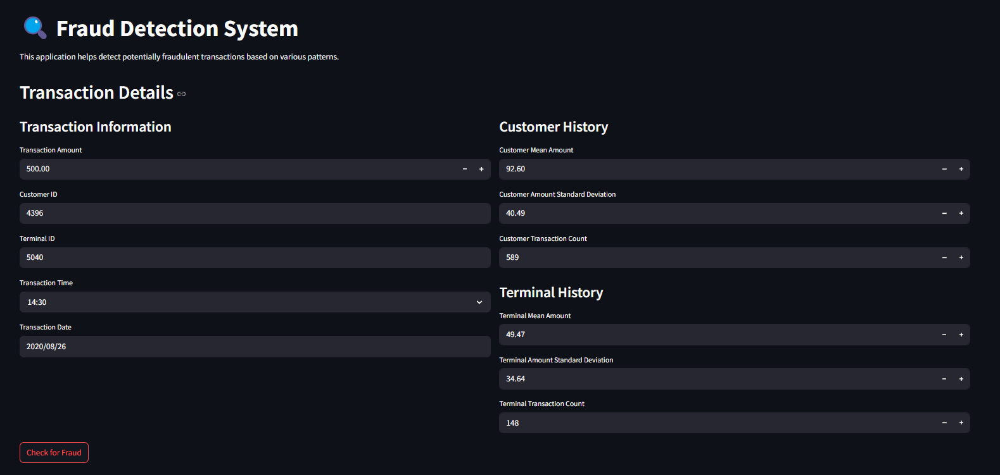
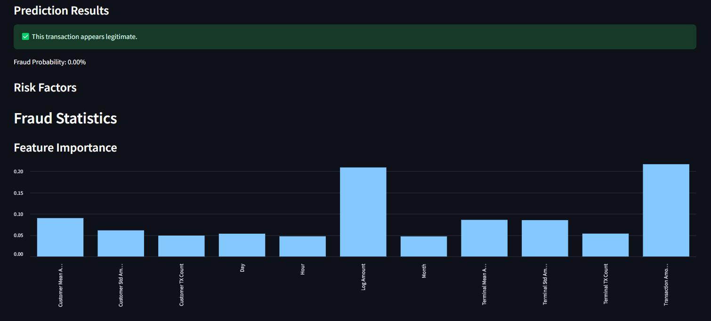
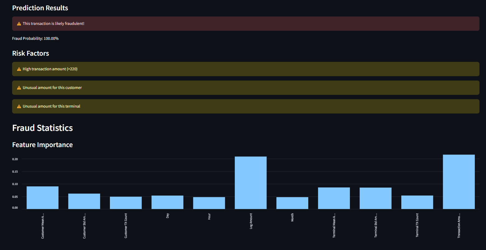

# Fraud Detection System

A machine learning-based system for detecting potentially fraudulent transactions in real-time.

## Overview

This project implements a fraud detection system using machine learning to identify suspicious transactions. The system analyzes various features of transactions, including:
- Transaction amount and timing
- Customer transaction history
- Terminal transaction history
- Temporal patterns

## Demo

Here are examples of how the system evaluates transactions:

### Input Interface

*The user interface for entering transaction details and historical statistics*

### Example Results

#### Legitimate Transaction Example

*A normal transaction with low fraud probability and no risk factors*

#### Fraudulent Transaction Example

*A suspicious transaction flagged with multiple risk factors showing:*
- High transaction amount (>220)
- Unusual amount for the customer
- Unusual amount for the terminal

## Features

- Real-time fraud detection
- Web-based interface using Streamlit
- Model training and evaluation
- Transaction testing capabilities
- Feature importance visualization
- Risk factor analysis

## Project Structure

```
fraud_detection/
├── app.py                 # Streamlit web application
├── fraud_detection.py     # Main training and model code
├── test_fraud_detection.py # Transaction testing script
├── convert_to_csv.py      # Data conversion utility
├── requirements.txt       # Python dependencies
└── README.md             # Project documentation
```

## Setup

1. Clone the repository:
```bash
git clone https://github.com/yourusername/fraud_detection.git
cd fraud_detection
```

2. Create and activate a virtual environment:
```bash
python -m venv venv
source venv/bin/activate  # On Windows: venv\Scripts\activate
```

3. Install dependencies:
```bash
pip install -r requirements.txt
```

## Usage

### Training the Model

1. Place your transaction data in the `data` directory
2. Run the training script:
```bash
python fraud_detection.py
```

### Testing Transactions

1. Use the test script to check individual transactions:
```bash
python test_fraud_detection.py
```

### Web Interface

1. Start the Streamlit app:
```bash
streamlit run app.py
```

2. Open your browser and navigate to `http://localhost:8501`

## Features Used for Detection

- Transaction Amount
- Log-transformed Amount
- Time of Transaction (Hour, Day, Month)
- Customer Statistics:
  - Mean Transaction Amount
  - Standard Deviation
  - Transaction Count
- Terminal Statistics:
  - Mean Transaction Amount
  - Standard Deviation
  - Transaction Count

## Model Performance

The system uses a Random Forest classifier with the following characteristics:
- Handles class imbalance
- Provides probability estimates
- Evaluates multiple risk factors
- Visualizes feature importance

## Contributing

1. Fork the repository
2. Create a feature branch
3. Commit your changes
4. Push to the branch
5. Create a Pull Request

## License

This project is licensed under the MIT License - see the LICENSE file for details.

## Acknowledgments

- Data preprocessing techniques
- Feature engineering approaches
- Machine learning model implementation

## Dataset Description
The dataset contains simulated transaction data with the following columns:
- TRANSACTION_ID: Unique identifier for the transaction
- TX_DATETIME: Date and time of the transaction
- CUSTOMER_ID: Unique identifier for the customer
- TERMINAL_ID: Unique identifier for the merchant terminal
- TX_AMOUNT: Amount of the transaction
- TX_FRAUD: Binary variable (0 for legitimate, 1 for fraudulent)

## Fraud Patterns
The system detects fraud based on three main patterns:
1. Transactions with amount > 220
2. Transactions from compromised terminals
3. Unusual spending patterns from compromised customer accounts 